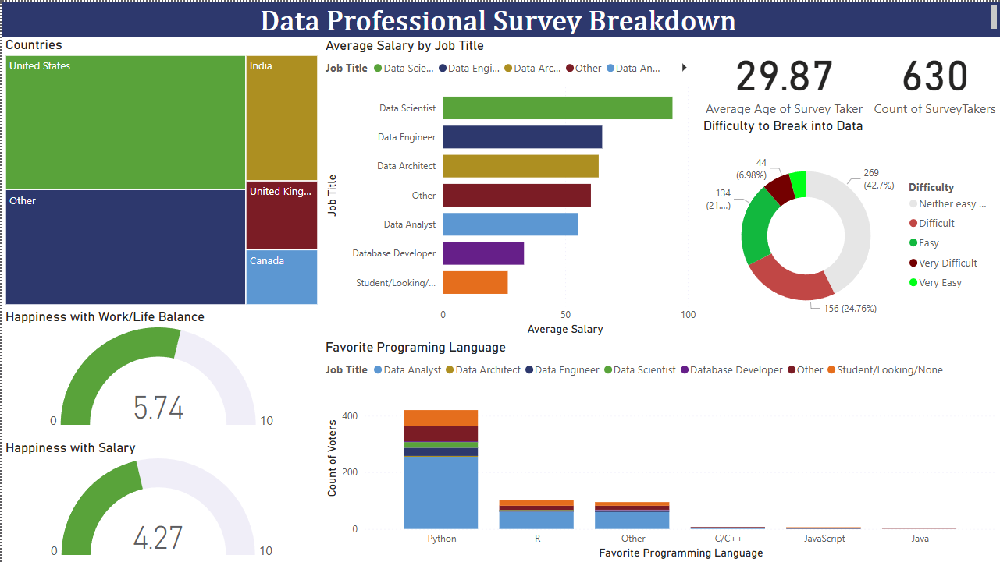

<h1 align="center">📊 Data Professional Survey Breakdown</h1>

  <b>Data Visualization Project built in Power BI</b> 
  This project analyzes the results of a global survey of data professionals. 
  The dashboard explores <b>salaries</b>, <b>job satisfaction</b>, <b>career difficulty levels</b>, 
  <b>preferred programming languages</b>, and <b>country-based trends</b> within the data industry.

  

<h2>📈 Project Overview</h2>

  The goal of this Power BI dashboard is to provide a clear and interactive visualization of how professionals 
  in the data field compare across various aspects such as earnings, happiness, experience, and tools they use.  
  The dataset was cleaned and transformed to allow for dynamic exploration and insights discovery.

<h2>📋 Key Insights</h2>
<ul>
  <li>Average salary by role</li>
  <li>Job satisfaction levels across different data careers</li>
  <li>Perceived career difficulty by position</li>
  <li>Most popular programming languages among data professionals</li>
  <li>Geographical distribution of survey respondents</li>
</ul>

<h2>📁 Data Source</h2>

  The dataset used for this visualization comes from the 
  <a href="https://github.com/AlexTheAnalyst/Power-BI/blob/main/Power%20BI%20-%20Final%20Project.xlsx" target="_blank">Data Professional Survey</a>, 
  which gathers global insights from professionals in the data industry.

<h2>🧠 Notes</h2>

  The dashboard focuses on clarity and accessibility, combining interactive visuals and filters 
  to make exploration easy and informative. It serves as both an analytical and storytelling tool 
  for understanding the state of data careers worldwide.

